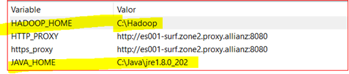
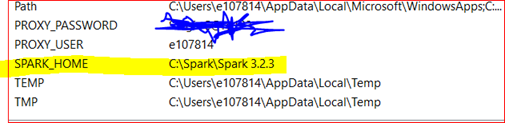
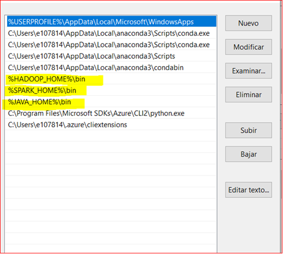

## Set up proxy :rocket:
--------------------
* set HTTPS_PROXY=http://es001-surf.zone2.proxy.allianz:8080
* set HTTP_PROXY=http://es001-surf.zone2.proxy.allianz:8080
* set PROXY_USER=eXXXXXX
* set PROXY_PASSWORD=pwd :

## Install environment 
----------------------
* conda env create -p .\venv -f .\bin\local\environment.yml :relaxed: 

## Github 
----------------------
* git checkout name_rama_interes_remoto **Cambia de rama en el repo local**
* git merge name_rama_remoto  **Fusiona la rama remota con la rama local actual**
* git push origin name_rama_actual_local:name_rama_remota **Hace push de la rama local a la rama remota**
* git add file_name **Agregar un fichero específico antes de un commit**
* git add . **Agrega todos los cambios ante de un commit**
* git commit -m "Mensaje descriptivo del commit" **Crea un commit con ese mensaje**
* git fetch origin **Actualiza el repositorio local, pero no actualiza los ficheros automaticamente**
* git pull origin name_rama_remota **Actualiza inmediatamente el repo local con la rama especificada**

**Gestión de issues y pull request:**

1. Generar un issue en la página web de github
2. Trabajar los cambios sobre la rama que gestionará el issue
3. Agregar los ficheros modificados con el comando git add
4. Hacer commit pero es muy importante incluir en el comentario el número del issue EX: "Resuleve #10" si el issue es el 10
5. Hacer push sobre tu rama (la rama encargada del issue)
6. Crear la pull request (base: Main) (compare : rama encargada del issue)
7. El revisor se encargará de validar que los cambios propuestos estan ok y entonces aceptará cambio y guardara la pull request.

## SPARK SETUP
----------------------------

1. Crea una carpeta en c que se llame workspace_github y dentro crea una carpeta que se llame Jars
2. En la carpeta Jars que acabas de crear guarda el fichero jars.7z que esta dentro de setup/java
3. Crea en C 3 carpetas, una que se llame Hadoop, otra Java y otra Spark
4. Descarga la versión de hadoop que necesitas de aqui: https://github.com/cdarlint/winutils/tree/master  **Necesitas la 3.0.1**
5. Guarda lo que descargaste de hadoop en la carpeta Hadoop
5. Para spark sigue este link https://archive.apache.org/dist/spark/ **Descarga spark.3.2.3-bin-hadoop3.2.tgz**
6. Descomprime el fichero .tgz y guardalo en la carpeta de spark
7. Descomprime en la carpeta Java el fichero jre1.8.0_202 que esta en setup/java
8. Crea las variables de entorno de la cuenta asi

9. Dentro de path

## Developers
----------------------
The developers responsible for the development and maintaining of this project.

* **Julian Caro** - *Author/Maintainer* - [mateocivil10@gmail.com](https://github.developer.allianz.io/jesusmanuel-sono)

